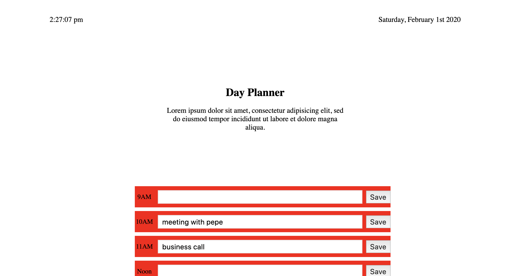

# Day Planner
Author: Ernesto Rodriguez

## Summary
This is a day planner app that uses local storage to save your tasks. It uses Moment.js to handle time and date.

**How it works.**
* The user saves task in time block.
* Task is saved to local storage.
* The task will change color if the current time is later then the task time.

## User Interface

## Deployed App
You can find the deployed application [here](https://erodrigueztoimil.github.io/day_planner//).
